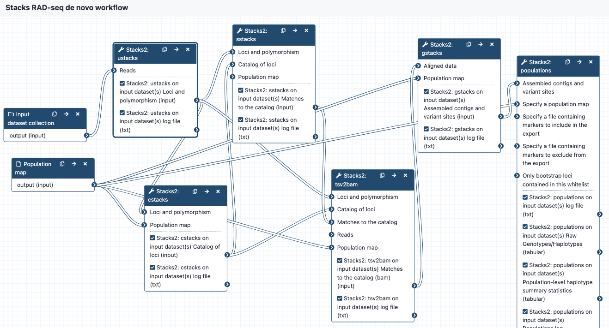

# workflow-denovo-stacks

These workflows are part of a set designed to work for RAD-seq data on the Galaxy platform, using the tools from the Stacks program. 

Galaxy Australia: https://usegalaxy.org.au/

Stacks: http://catchenlab.life.illinois.edu/stacks/

## Inputs
* demultiplexed reads in fastq format, may be output from the QC workflow. Files are in a collection. 
* population map in text format

## Steps and outputs

ustacks:
* input reads go to ustacks. 
* ustacks assembles the reads into matching stacks (hypothetical alleles). 
* The outputs are in a collection called something like: Stacks2: ustacks  on data 21, data 20, and others Loci and polymorphism. Click on this to see the files:
* for each sample, assembled loci (tsv format), named e.g. sample_CAAC.tags
* for each sample, model calls from each locus (tsv format), named e.g. sample_CAAC.snps
* for each sample, haplotypes/alleles recorded from each locus (tsv format), named e.g. sample_CAAC.alleles
* Please see sections 6.1 to 6.4 in https://catchenlab.life.illinois.edu/stacks/manual/#ufiles for a full description. 

cstacks:
* cstacks will merge stacks into a catalog of consensus loci. 
* The outputs are in a collection called something like Stacks2: cstacks  on data 3, data 71, and others Catalog of loci. Click on this to see the three files, each in tsv format:
catalog.tags
catalog.snps
catalog.alleles

sstacks:
* sstacks will compare each sample to the loci in the catalog. 
* The outputs are in a collection called something like Stacks2: sstacks  on data 3, data 76, and others Matches to the catalog.Click on this to see the files:
There is one file for each sample, named e.g. sample_CAAC.matches, in tsv format. 

tsv2bam:
* Conversion to BAM format
* Reads from each sample are now aligned to each locus, and the tsv2bam tool will convert this into a bam file for each sample. 
* The outputs are in a collection called something like Stacks2: tsv2bam  on data 3, data 94, and others Matches to the catalog.Click on this to see the files:
There is one file for each sample, named e.g sample_CAAC.matches, in BAM format. 

gstacks:
* Catalog of loci in fasta format
* Variant calls in VCF format

populations:
* Locus consensus sequences in fasta format
* Snp calls, in VCF format
* Haplotypes, in VCF format
* Summary statistics

